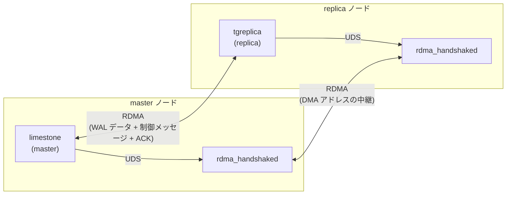

# RDMA レプリケーションの TCP レス化: 設計と実装計画

## 本ドキュメントについて

現在の limestone は、RDMA レプリケーションモード (`REPLICATION_RDMA_SLOTS` 指定時) においても、
master と replica の間に TCP コントロールチャネルを 1 本張り、プロセスの寿命の間ずっと維持している。
本ドキュメントは、これを解消し、**RDMA モードを選択したときに TCP/IP を一切使わない**ようにするための
設計と実装計画を記述する。

前提となる方針は以下のとおり。

* **TCP レプリケーションは廃止しない。** `ENABLE_RDMA=OFF` のビルド、および RDMA を指定しない
  起動では、従来どおり TCP でレプリケーションを行う。TCP と RDMA の両立は維持する。
* 追従先は rdma-comm-lib の **master 最新** (handshake daemon 導入済み、`e2ea2e7` 以降) とする。
* **BLOB 転送は現行方式を維持する。** WAL ストリームにインラインで載せる現在の実装を残し、
  rdma-comm-lib の `rdma_blob_relay` への移行は行わない (§2.2)。
* **handshake daemon (`rdma_handshaked`) は外部で運用される前提**とし、limestone はそこに接続するだけとする。

関連ドキュメント:

* [RDMA 抽象化レイヤー](rdma-abstraction-layer.md)
* [レプリケーション機能の実装方針](replication-impl.md)
* [レプリケーションプロトコル](20250306-replication-protocol_ja.md)

---

## 1. 現状分析

### 1.1 RDMA モードで TCP を流れているもの

RDMA モードでも、以下は依然として TCP コントロールチャネル (`datastore_impl::control_channel_`) を流れている。

| メッセージ | 方向 | 現状 | 頻度 |
|---|---|---|---|
| `SESSION_BEGIN` / `SESSION_BEGIN_ACK` | master ⇄ replica | TCP | 起動時 1 回 |
| `RDMA_INIT` / `RDMA_INIT_ACK` | master ⇄ replica | TCP | 起動時 1 回 |
| `RDMA_FINALIZE` / `RDMA_FINALIZE_ACK` | master ⇄ replica | TCP | 起動時 1 回 |
| `GROUP_COMMIT` / `COMMON_ACK` | master ⇄ replica | **TCP** | **エポック切り替えごと** |
| `LOG_ENTRY` (BLOB 含む) | master → replica | RDMA | 定常 |
| `LOG_ENTRY` の ACK | replica → master | RDMA | 定常 |
| `LOG_CHANNEL_CREATE` / ACK | — | RDMA モードでは送らない | — |

すなわち、**初期化のためだけに TCP が残っているのではない**。エポック切り替えのたびに
`propagate_group_commit()` → `wait_for_propagated_group_commit_ack()` が TCP の同期往復を行っている
(`datastore_impl.cpp:245-318`)。RDMA モードでもこの往復は無条件に実行される。

また replica 側は、RDMA モードでも TCP の listen ソケットと accept ループを持ち
(`replica_server::start_listener()` / `accept_loop()`)、master からの制御チャネル 1 本を accept して
1 スレッド (`limestone-ctrl`) を常駐させている。

### 1.2 TCP を外せない最大の理由

RDMA 経路を確立するには、互いの受信バッファの DMA アドレスを交換する必要がある。現状これは
`RDMA_INIT` / `RDMA_INIT_ACK` を **TCP で** やり取りすることで実現している
(`datastore_impl.cpp:178-212`, `message_rdma_init.cpp:83`)。

RDMA で相手に書き込むには、**相手の受信バッファの DMA アドレスを事前に知っている必要がある**
(`rdma_sender::initialize(dma_address_type remote_dma_address)`)。しかし RDMA 経路がまだ張れていない
段階では、そのアドレスを RDMA で問い合わせることはできない。「RDMA を張るために RDMA が必要」という
循環があり、これを断ち切るアウトオブバンドの経路が必ず要る。

現状の limestone はこれを TCP で行っている。rdma-comm-lib のコア API は host / port を一切受け取らないため、
DMA アドレスを外から与えるしかなく、その手段が TCP しかなかった。これが「TCP を一切使わない」ことを
阻む本質的な障壁である。

rdma-comm-lib はこの循環を **handshake daemon** で解決した。各ノードで常駐する `rdma_handshaked` が
**あらかじめ daemon 同士で RDMA 経路を張っておく**。アプリケーションはローカルの daemon に
**Unix ドメインソケット** (ローカル通信なので TCP 不要) で接続し、「相手の DMA アドレスを教えてくれ」と
頼む。daemon はその daemon 間 RDMA を使ってアドレスを中継する。これで TCP なしにアドレス交換ができる。

なお rdma-comm-lib が RDMA に載せた「制御チャネル」(`ac84f14`) は、**rdma-comm-lib 自身の**
制御メッセージ (blob_relay の file_transfer や shutdown) の話であり、limestone のメッセージ
(SESSION_BEGIN、GROUP_COMMIT など) ではない。**limestone のメッセージをどう RDMA に載せるかは
limestone 自身が設計する**必要がある。それが本ドキュメントの主題である。

### 1.3 rdma-comm-lib 側の破壊的変更 (影響は最下層に限定される)

追従にあたって、limestone が現在使っている送信 API が消滅している。

**新しい送信モデル**: 「バイト列を渡す」(`send_bytes()`) 方式から、**「送信バッファを借りて、直接
書き込んで、返す」** 方式に変わった。

```
frame = stream.acquire_frame_buffer(max_payload)  // 送信リングから 1 フレーム分借りる
memcpy(frame.payload, ...)                        // 借りた領域に直接書き込む (コピー 1 回不要)
stream.submit_frame_buffer(frame, size)           // フレームヘッダを書いて RDMA 送信
stream.flush(timeout)                             // 全フレームの ACK 到着を待つ
```

`acquire` と `submit` は 1 対 1 で対になる。借りた領域は送信リングのスロットを占有し、**受信側から
ACK が返って初めて解放される**。したがって ACK が滞るとリングが枯渇し、`acquire_frame_buffer()` が
待たされる (これがフロー制御になっている)。

**`submit_frame_buffer()` と `submit_control_frame_buffer()` の違いはフラグ 1 ビットだけ**である。
後者はフレームヘッダに `rdma_frame_flag_control` を立てる。ライブラリの doc コメントいわく
「Identical to submit_frame_buffer() except that the frame header carries
rdma_frame_flag_control」。シーケンス管理・ACK・送信バッファプール・輻輳制御はすべて共通で、
**トランスポート層はこのフラグを解釈しない**。フラグをどう使うかは受信側アプリケーションの自由である
(limestone での使い道は §3.2)。

| 旧 API (limestone が使用中) | 新 API | 影響箇所 |
|---|---|---|
| `rdma_send_stream::send_bytes()` | `acquire_frame_buffer()` + `submit_frame_buffer()` | `log_channel_impl.cpp:172` |
| `rdma_send_stream::send_all_bytes()` | 同上 | `rdma_replication_message_io.cpp:50` |
| `rdma_send_stream::send_with_writer()` | 同上 (ゼロコピーは `frame.payload` への直接書き込みで実現) | `rdma_replication_message_io.cpp:65, 105` |
| `rdma_receiver::register_channel()` | `finalize_channel_setup_with_sender()` | — |
| `get_send_stream(channel_id, ack_fd)` | `get_send_stream(channel_id)` (ACK は RDMA 経路) | — |
| (なし) | `submit_control_frame_buffer()` | 新規。ただし**本作業では使わない** (§3.2) |
| (なし) | `take_ack_body()` | 新規: ACK に載ってきた応答ボディを取り出す。ただし**本作業では使わない** (§3.3) |

**ただし影響範囲は「バイト列を RDMA へ吐き出す最下層」に限定される。** limestone のレプリケーション
実装は、メッセージのシリアライズと、バイト列の搬送とが既に分離されているためである。

| 層 | 実体 | 本作業での扱い |
|---|---|---|
| メッセージ定義・ワイヤ形式 | `replication_message`, `message_*`, `primitive_wire_codec` | **変更なし。そのまま流用** |
| シリアライズ / デシリアライズ | `replication_message_io` (基底) | **変更なし。そのまま流用** |
| RDMA 搬送 | `rdma_replication_message_io` (string-mode で基底を継承し、溜めたバイト列を RDMA へ流す) | 最下層の送信呼び出しのみ置換 |
| RDMA ラッパー | `rdma_send_stream_base` とその実装 | メソッドを `send_bytes` 系から `acquire`/`submit` 系へ入れ替え |

すなわち `rdma_send_stream_base` は rdma-comm-lib の薄いラッパーであり、シリアライズとは無関係の層である。
ここのメソッドが入れ替わるだけで、**その上のシリアライズ層とメッセージ定義には手を入れない**。

---

## 2. 目標と非目標

### 2.1 目標

1. RDMA モードで起動したとき、master・replica ともに **TCP ソケットを一切開かない**。
   `TSURUGI_REPLICATION_ENDPOINT` も参照しない。
2. TCP モード (RDMA 未指定、または `ENABLE_RDMA=OFF` ビルド) の挙動は現状のまま維持する。
3. rdma-comm-lib master 最新の API に追従する。
4. 既存のレプリケーションのセマンティクス (WAL の順序、group commit の同期、BLOB の内容一致) を維持する。

### 2.2 非目標 (本作業のスコープ外)

1. BLOB 転送の `rdma_blob_relay` への移行。
2. TCP レプリケーション経路の削除。
3. handshake daemon のライフサイクル管理 (起動・停止・conn_info ファイルの配布)。
4. 複数 replica 対応。
5. **レプリケーションのエラーハンドリングと可用性の改善**。TCP 版から引き継ぐ課題であり、
   RDMA 化とは独立している。本作業では**現状と同等の挙動を維持する**にとどめる
   (詳細と現状分析は §7.7)。

---

## 3. 全体アーキテクチャ

### 3.1 接続確立: handshake daemon 経由

TCP の `connect()` / `accept()` を、handshake daemon 経由のハンドシェイクに置き換える。



* limestone (master) は **connect 側** (`handshake_connector`)。
* tgreplica (replica) は **accept 側** (`handshake_acceptor`)。
* limestone は daemon の **Unix ドメインソケットのパス** と **service_id** を設定として受け取る。
  host / port は使わない。
* daemon 自体の起動、`--export-conn-info` / `--import-conn-info` の指定、conn_info ファイルの
  ノード間コピーは **limestone の責務ではない** (外部運用)。

**責務の分業**: クライアントライブラリが担うのは「初期化パラメータ (ペイロード) の中継」だけである。
受信バッファの確保と RDMA 送受信の初期化は **利用モジュール (limestone) の責務**であり、
ライブラリは関与しない。

以下、rdma-comm-lib の公式ドキュメント (nt-tsurugi-internal リポジトリの
`docs/topics/rdma-library-maintenance/`) に定められた制約のうち、limestone の実装に直接影響するもの。

**制約 1: accept 先行**
accept 側 (replica) が先に `wait_for_start()` に入っている必要がある。受付側の先行を待ち合わせる
仕組みは daemon 側に設けられていない。connect 側が先に `start()` すると成功せず、**再試行は
`create_connector()` からやり直す** (失敗した `start()` を同じインスタンスで呼び直すのではない)。
再試行の回数・時間は利用モジュールの方針で決める。master 側にリトライループを実装する。

**制約 2: SIGPIPE がプロセス全体で SIG_IGN にされる**
`handshake_connector` / `handshake_acceptor` の生成時に、クライアントライブラリが
**プロセス全体の `SIGPIPE` を無視 (`SIG_IGN`) に設定する**。設定は一度だけで冪等。
Tsurugi プロセス全体への影響だが、無視して問題ないことは確認済みである (§7.6)。

**制約 3: クリーンアップはインスタンス破棄のみ**
エラー時も含め、ハンドシェイクの後始末は `handshake_connector` / `handshake_acceptor` の
インスタンスを破棄するだけでよい。破棄すると UDS セッションがクローズし、daemon がそれを検知して
自ノード側のセッション状態を解放し、**相手ノードの daemon にも通知して相手側のセッション状態も
解放させる**。したがって正常完了・失敗・daemon 障害のいずれでも、破棄すればクリーンアップは完了する。

ただし逆に言えば、**インスタンスを破棄するとそのハンドシェイクは中断され、相手側のハンドシェイクも
失敗する**。これは異常時の意図した挙動である。limestone 側では、ハンドシェイク成功後に速やかに
インスタンスを破棄してよい (RDMA 経路は既に確立しており、以降 daemon は不要)。

なお、受信バッファなど limestone が自前で確保したリソース (rdma-comm-lib のコア由来のものを含む) の
後始末は、この破棄の対象外であり limestone の責務である。

### 3.2 RDMA チャネル構成

#### 用語の定義

本ドキュメントで「制御チャネル」と呼ぶものを、まず定義する。紛らわしい同名の概念が 3 つあるためである。

| 呼称 | 実体 | 本作業での扱い |
|---|---|---|
| **TCP コントロールチャネル** | 現状の `datastore_impl::control_channel_` (TCP の `replica_connector`)。SESSION_BEGIN、GROUP_COMMIT、RDMA_INIT などを流している | **廃止する**。これを無くすのが本作業の目的 |
| **rdma-comm-lib の制御フレーム** | `rdma_frame_flag_control` という 1 ビットのフラグ。トランスポート層はこれを解釈しない。`submit_control_frame_buffer()` は `submit_frame_buffer()` にこのフラグを立てるだけの API | **使わない**。将来のために温存する (後述) |
| **limestone の制御チャネル** | ← **本節で新たに定義するもの**。以下で述べる | **新設する** |

**limestone の制御チャネル**とは、次のものである。

> rdma-comm-lib の**通常のチャネル**を、log_channel 用のものとは別に **1 本追加で確保**し、
> **limestone の制御メッセージ (`GROUP_COMMIT` など) だけを流すチャネルと定めたもの**。

つまり、これは limestone がアプリケーション層で定める**規約**にすぎない。rdma-comm-lib 側に
「制御チャネル」という機能があってそれを使うわけではない。ライブラリから見れば、これは他と何ら
変わらない普通のチャネルである。blob_relay も同じことをアプリ層で行っている。

#### チャネル構成

| channel_id | 用途 |
|---|---|
| `0` .. `N-1` | log_channel ごとの WAL データ (BLOB 含む)。`N` = log_channel 数 |
| `control_channel_id` | limestone の制御メッセージ (`GROUP_COMMIT` など) |

**チャネルを分ける理由**は、受信側を単純に保つためである。データチャネルの受信は
`rdma_log_entries_receiver` が担い、これは `LOG_ENTRY` のバイト列を組み立てる専用のストリーミング
パーサである。制御メッセージを相乗りさせること自体は `consume()` の手前で message type を見て
振り分ければ実装可能だが、そうするとパーサが LOG_ENTRY の組み立て途中の状態を持ったまま別種の
メッセージの割り込みを扱うことになる。チャネルを分ければ、振り分けは `channel_id` だけで決まり、
パーサは LOG_ENTRY 専用のまま変更不要で済む。

なお**輻輳の観点で分ける利点はない**。送信バッファプールは全チャネル共有の単一 FIFO リングであり、
WAL データがリングを埋め切っている間は制御フレームの `acquire_frame_buffer()` も等しく待たされる。
head-of-line blocking はチャネルを分離しても解消しない。

#### handshake で交換するチャネル情報

handshake payload では **`channel_count` (= `N`) と `control_channel_id` の 2 値**を渡す (§3.4)。
replica は「データチャネルは `0` .. `N-1` の連番」という規約でデータチャネルを復元する。

**channel_id のリストは渡さない**。現状の `RDMA_FINALIZE` は channel_id の `std::vector` を運んで
いるが (`message_rdma_finalize`)、その中身は `0` から `N-1` までの連番にしかならない。master 側は
`log_channels_` を先頭から順に回して積んでおり (`datastore.cpp:410-419` の `maybe_register_rdma_stream()`
呼び出し)、RDMA モードで送信ストリームの取得に失敗すれば `maybe_register_rdma_stream()` 内で
`LOG_LP(FATAL)` で落ちるため (`datastore.cpp:1150`)、歯抜けは生じない。リストは
`channel_count` から復元できる冗長な情報である。

加えて、log_channel の上限は 10000 (`log_channel_slots_limit`) であり、`uint64` のリストを送ると
最悪 80 KB に達する。handshake payload にこのサイズを載せるのは避けたい。

**`control_channel_id` は `channel_count` から導出せず、値そのものを渡す**。blob_relay は
「`control_channel_id = channel_count`」という決め打ちで導出しているが、この規約を採ると
**チャネル ID の割り当てルールが master と replica の両方にハードコードされる**。値を明示すれば
replica は割り当てルールを知らずに済み、将来チャネル構成を変更しても受信側の解釈は壊れない。
payload の増分は数バイトである。

#### 受信側のディスパッチ: channel_id で振り分ける

受信ハンドラはプロセスに 1 つだが、`rdma_receive_event` の `header.channel_id` で振り分けられる。
現状 `replica_server::handle_rdma_data_event()` は `channel_id` を log_channel ハンドラ配列の添字と
してのみ解釈しており、`channel_id >= max_log_channel_slots` (`= log_channel_slots_limit`) なら
ERROR ログを出して return する既存のレンジチェックを持つ (`replica_server.cpp:527-547`)。ここに
「`channel_id == control_channel_id` なら制御ハンドラへ」という分岐を、**この既存レンジチェックより
前**に追加する。

**`control_channel_id` の値域制約**: `control_channel_id` は `channel_count` (データチャネルの数 `N`)
以上の値でなければならない (`0` .. `N-1` はデータチャネルの ID であり、衝突すると誤ったハンドラに
配送される)。`control_channel_id >= max_log_channel_slots` を許すかどうか (既存レンジチェックの外に
置くか内に置くか) はフェーズ 2 実装時に決める。master 側でこれらの制約を満たす値を生成することで
保証し、replica 側では特別なバリデーションを追加しない (§3.1 で述べたとおり、責務の分業は
「初期化パラメータの中継」のみであり、値の妥当性は送信元である master が担保する)。

**`replication_message` のワイヤ形式に判別用フィールドを追加する必要はない**。§1.3 で述べた
「メッセージ定義・ワイヤ形式は変更なし」の方針を保てる。

#### 送信 API: `rdma_frame_flag_control` は使わない

制御チャネルへの送信にも、データチャネルと同じ **`submit_frame_buffer()` を使う**。
`submit_control_frame_buffer()` (= フレームヘッダに `rdma_frame_flag_control` を立てて送る API、
§1.3) は**使わない**。

制御メッセージとデータの振り分けは `channel_id` だけで足りるため、フラグを立てる必要がない。
「制御チャネルなのだから制御フレーム API を使う」というのは、ライブラリ側にそういう対応関係が
あるかのような誤解を招くだけで、実際には何の意味も持たない (両者の違いはフラグ 1 ビットで、
トランスポート層はそれを解釈しない)。

**フラグを温存する理由**: いま `rdma_frame_flag_control` に「制御チャネルを流れるフレームの印」
という意味を与えてしまうと、**将来データチャネル上で制御的なフレームを流したくなったときに、
フラグの意味が二重になって使えなくなる**。本来このフラグは「ペイロードが制御メッセージである」
ことを示すものであり、チャネルの別を示すものではない。不要な用途で意味を確定させず、本来の用途の
ために残しておく。

なお blob_relay はこのフラグを立て、受信側で「制御フラグが立っているのに制御チャネル以外から
届いたフレーム」を drop している (`blob_relay_rdma_impl.cpp:242-257`)。しかし limestone の制御
メッセージ送信は `rdma_control_channel` の 1 箇所に閉じており、送信先は `control_channel_id` 固定で
あるため、この種の取り違えは起こりえない。検証のためだけにフラグを使う理由はない。

#### 制御チャネルの送信ストリームの排他

`rdma_send_stream` は非スレッドセーフである。そして group commit の送信スレッドは固定されない。
`write_epoch_callback_` の呼び出し元は epoch スレッドだけでなく、log_channel の `end_session()` →
`finalize_session_file()` → `update_min_epoch_id()` という経路もあるためである
(`log_channel.cpp:104`)。**どの log_channel のスレッドが送信するかは実行ごとに変わりうる**。

**それでも新たな mutex は導入しない。既存の排他で足りている。** 定常状態での
`write_epoch_callback_()` の呼び出しは `update_min_epoch_id()` の CAS
(`compare_exchange_strong`、`seq_cst`) で直列化されたうえ、**`mtx_epoch_file_` の `lock_guard` の
内側にある** (`datastore.cpp:541`)。同時実行もメモリ可視性の問題も起きない。TCP 版が
`control_channel_` を明示的な排他なしに共有できているのもこのためである。ここに専用の mutex を
重ねるのは過剰である。

なお `datastore::ready()` 内にもロック外の呼び出しが 1 つあるが (`datastore.cpp:385`)、
`ready()` は起動シーケンスであり log_channel / epoch スレッドはまだ動いていないため、
そもそも並行呼び出しが起こらない。

ただし**この依存関係はコードから読み取りにくい**。制御ストリームの送信箇所に、
「呼び出し元が `mtx_epoch_file_` の下で直列化されていることに依存しており、この前提が崩れると
非スレッドセーフな `rdma_send_stream` へ複数スレッドが同時に触りうる」旨をコメントで明記する。

### 3.3 group commit の同期応答は ACK フレームの到着で代替する

group commit は master → replica の送信に対する **同期応答** が必要である
(`wait_for_propagated_group_commit_ack()`)。現状これは TCP の `receive_message()` で
`COMMON_ACK` を受け取ることで実現している。

**RDMA では `flush()` の完了をもって同期とする。応答メッセージは送らない。**

master 側の 1 回の group commit は次の 3 ステップで完結する。

```
frame = acquire_frame_buffer(size)   // 制御チャネルの送信リングから借りる
submit_frame_buffer(frame, size)     // GROUP_COMMIT を送る
flush(timeout)                       // ACK の到着を待つ = replica 側の処理完了
```

**`flush()` はチャネル単位である。** 送信バッファプールは全チャネル共有の単一リングだが (§3.2)、
`flush()` が待つのは当該チャネル (ここでは制御チャネル) の未 ACK フレームのみであり、他チャネル
(WAL データ) の未 ACK フレームは待たない。したがって group commit の `flush()` が WAL 全体の ACK を
待たされることはない。既存の RDMA WAL 経路 (`log_channel_impl::flush_rdma_stream()`) も同じ単位で
使っている。

**なぜこれで足りるか**。rdma-comm-lib はすべてのフレームに ACK を返す。そして受信ハンドラは
**同期的に呼ばれ、ハンドラが返ってから ACK フレームが送出される**。したがって `flush()` が成功した
時点で、replica 側の `persist_and_propagate_epoch_id()` は完了している。

そして**現状の master はこれ以上の情報を使っていない**。`wait_for_propagated_group_commit_ack()` は
受け取ったメッセージの**型が `COMMON_ACK` かどうかしか見ておらず** (`datastore_impl.cpp:311`)、
`message_ack` にはフィールドが 1 つもない (`message_ack.h`)。master が使っているのは
「期待どおり応答が来たか否か」という 1 bit だけであり、これは ACK フレームの到着で完全に代替できる。

**replica 側の受信ハンドラ**: 制御チャネルのフレームを受け取ったら、その場で
`persist_and_propagate_epoch_id()` を実行する。応答は返さない (`receive_handler` の戻り値は
`std::nullopt`)。TCP 版の `message_group_commit::post_receive()` から `COMMON_ACK` の送信を除いた
処理に相当する。

#### ACK ボディは使わない (将来のために残す)

rdma-comm-lib には、受信ハンドラの戻り値を ACK フレームのボディとして送り返す仕組みがある
(`initialize(receive_handler_with_ack)` と `take_ack_body()`)。**本作業ではこれを使わない。**
現状の応答に載せるべき情報がなく、空の `COMMON_ACK` を運ぶだけになるためである。

**将来エラー応答が必要になったときの受け皿として残しておく。** 現状、replica 側で
`persist_and_propagate_epoch_id()` が失敗すると `limestone_io_exception` が飛び、
`message_group_commit::post_receive()` に try/catch がないため **ACK を返さずに接続が閉じられる**
(`replica_server.cpp:304-311`。同箇所に「将来 `COMMON_ERROR` を返したい」という TODO がある)。
プロトコル仕様には `response.group_commit_error` が定義されているが
(`20250306-replication-protocol_ja.md:187-188`)、実装は未着手である。

これを実装する際には、replica 側の受信ハンドラを `receive_handler_with_ack` に変え、エラー情報を
`ack_body` に載せて返せばよい。**本作業のスコープ外とする** (§2.2)。エラーハンドリングの改善は
TCP 版にも同じ課題があり、RDMA 化とは独立した課題である。

### 3.4 初期化シーケンス

rdma-comm-lib の API 順序制約 (`get_send_stream()` は `finalize_channel_setup()` より前、
`send_buffer_pool` は finalize で初めて生成される) に従う。

```
[replica: accept 側]                        [master: connect 側]

receiver 生成・initialize()                  receiver 生成・initialize()
local_dma = receiver->get_dma_address()      local_dma = receiver->get_dma_address()

acceptor = create_acceptor(uds_path)         connector = create_connector(uds_path)
wait_for_start(service_id)         ◄──────── start(service_id, start_payload)
  payload からチャネル構成と
  peer_dma を取得
send_response(response_payload)    ────────► receive_response()
                                               payload から peer_dma を取得

sender 生成・initialize(peer_dma)            sender 生成・initialize(peer_dma)
get_send_stream(ch 0..N-1, 制御 ch)          get_send_stream(ch 0..N-1, 制御 ch)
receiver->finalize_channel_setup_with_sender(sender)   (同左)
sender->finalize_channel_setup()                       (同左)

receive_finalize()                 ◄──────── send_finalize(payload)
complete()                         ◄──────── send_ready()
                                   ────────► receive_completion()

        ここから RDMA でのデータ・制御メッセージの送受信が可能
```

**注意**: 上記の `send_finalize()` は rdma-comm-lib の handshake が提供する 5 ステップ
(`start` → `response` → `finalize` → `ready` → `completion`) のうちの 1 つであり、
limestone の既存メッセージ `RDMA_FINALIZE` とは別物である。既存 `RDMA_FINALIZE` が運んでいた情報
(`channel_count`、`control_channel_id`) は、この `finalize` ステップではなく**上記の
`start_payload`** に統合する (下表)。`finalize` ステップの payload には limestone 固有の情報は
載せない。

**start payload (master → replica)**: 既存の `SESSION_BEGIN` / `RDMA_INIT` / `RDMA_FINALIZE` が
運んでいた情報を 1 つにまとめる。**すべて固定長で、数十バイトに収まる**。

| フィールド | 由来 | 備考 |
|---|---|---|
| `protocol_version` | `SESSION_BEGIN` | |
| `configuration_id` | `SESSION_BEGIN` | 可変長 (文字列) |
| `epoch_number` | `SESSION_BEGIN` | |
| `slot_count` | `RDMA_INIT` | 送信バッファのリング容量 |
| `master_dma_address` | `RDMA_INIT` | master の receiver の DMA アドレス |
| `channel_count` (`N`) | `RDMA_FINALIZE` の channel_id リストを置換 | データチャネルは `0` .. `N-1` |
| `control_channel_id` | 新規 | §3.2 |

**channel_id のリストは送らない** (§3.2)。連番であることが保証されており `channel_count` から
復元できるうえ、log_channel 上限 10000 では最悪 80 KB になり handshake payload に載せるには大きい。

**response payload (replica → master)**: `replica_dma_address` (replica の receiver の DMA アドレス)
と、受理 / 拒否の結果。既存の `SESSION_BEGIN_ACK` / `RDMA_INIT_ACK` / `RDMA_FINALIZE_ACK` に相当する。

**重要な注意**: `send_ready()` / `receive_completion()` の完了前に RDMA 書き込みを行ってはならない。
相手がまだ ACK 返送路 (bound sender) を持っておらず、`flush()` が永久に完了しなくなる。

**プロセス終了順序**: 自分の receiver は相手の書き込み先であり、自分の sender は相手の ACK 返送路である。
相手より先にプロセスを終了させてはならない。既存の shutdown シーケンスにこの制約を織り込む。

### 3.5 既存メッセージのマッピング

新しい制御チャネル上では、既存の replication メッセージをそのまま流用する。ワイヤ形式
(`replication_message` のシリアライズ) は変更しない。

| 既存メッセージ | 新経路 | 備考 |
|---|---|---|
| `SESSION_BEGIN` / `_ACK` | handshake の start / response payload に統合 | メッセージとしては送らない |
| `RDMA_INIT` / `_ACK` | handshake の start / response payload に統合 | 同上。DMA アドレスは payload が運ぶ |
| `RDMA_FINALIZE` / `_ACK` | handshake の start / response payload に統合 | channel_id リストは `channel_count` に置き換える (§3.4) |
| `GROUP_COMMIT` | 制御チャネル | 通常のフレームで送る (`rdma_frame_flag_control` は使わない。§3.2) |
| `COMMON_ACK` (group commit 応答) | **送らない** | ACK フレームの到着 (`flush()` の完了) で代替 (§3.3) |
| `LOG_ENTRY` | データチャネル (ch 0..N-1) | 現行どおり |
| `LOG_CHANNEL_CREATE` / `_ACK` | 送らない | 現行どおり (channel 数は handshake payload が運ぶ) |

`SESSION_BEGIN` / `RDMA_INIT` / `RDMA_FINALIZE` を handshake payload に統合するのは、handshake が
すでに「start → response → finalize → ready → completion」の 5 ステップを提供しており、これらの
メッセージが運んでいた情報 (protocol version、slot_count、DMA アドレス、チャネル構成) を
そのまま載せられるためである。TCP 用のこれらのメッセージクラスは TCP モードのために残す。

---

## 4. 設定パラメータ

RDMA モードの起動を、TCP のエンドポイント指定から独立させる。

### 4.1 新規

| 環境変数 | 対象 | 意味 |
|---|---|---|
| `TSURUGI_REPLICATION_HANDSHAKE_SOCKET` | master / replica | handshake daemon の UDS パス。設定されていれば RDMA モード |
| `TSURUGI_REPLICATION_SERVICE_ID` | master / replica | handshake の service_id (uint64)。master と replica で同じ値 |

`service_id` は TCP のポート番号に相当する論理ラベルである。`0` と `uint64 max` は rdma-comm-lib の
予約値で使用できない。同じ daemon を共有する他アプリケーションと衝突しない値を運用側で取り決める。
limestone のデフォルト値をドキュメントに定める。

### 4.2 既存

| 環境変数 | 変更後の扱い |
|---|---|
| `REPLICATION_RDMA_SLOTS` | 引き続き RDMA のバッファスロット数。**RDMA モードの判定には使わない** |
| `TSURUGI_REPLICATION_ENDPOINT` | TCP モードでのみ使用。RDMA モードでは参照しない |

### 4.3 モード判定

```
TSURUGI_REPLICATION_HANDSHAKE_SOCKET が設定されている
    → RDMA モード (TCP を一切使わない)
        ENABLE_RDMA=OFF ビルドなら起動時エラー
TSURUGI_REPLICATION_ENDPOINT が設定されている
    → TCP モード (現行どおり)
どちらも未設定
    → レプリケーションなし
両方設定されている
    → 起動時エラー (曖昧な設定を許さない)
```

現状 `REPLICATION_RDMA_SLOTS` は master でしか読まれず、replica 側の slot_count は master が
`RDMA_INIT` で送ってきた値を使っている。この構造は維持し、handshake の start payload に slot_count を載せる。

---

## 5. 主要な変更対象

### 5.1 新規追加

| ファイル | 内容 |
|---|---|
| `src/limestone/rdma/rdma_frame_buffer_base.h` | `frame_buffer` の抽象 (payload ポインタ + capacity) |
| `src/limestone/rdma/handshake_client_base.h` | handshake connector / acceptor の抽象インターフェース |
| `src/limestone/rdma/rdma_comm/rdma_comm_handshake_*.{h,cpp}` | rdma-comm-lib の handshake クライアントのラッパー |
| `src/limestone/rdma/null/null_handshake_*.{h,cpp}` | ENABLE_RDMA=OFF 用の null 実装 |
| `src/limestone/replication/rdma_control_channel.{h,cpp}` | 制御チャネルの送受信。master 側は acquire → submit → flush、replica 側は受信ハンドラ |
| `src/limestone/replication/rdma_handshake_payload.{h,cpp}` | handshake payload のエンコード / デコード |
| `src/limestone/replication/replication_config.{h,cpp}` | モード判定と設定パラメータの一元化 |

### 5.2 大幅な変更

| ファイル | 変更内容 |
|---|---|
| `src/limestone/rdma/rdma_send_stream_base.h` | `send_bytes` / `send_all_bytes` / `send_with_writer` を削除し、`acquire_frame_buffer` / `submit_frame_buffer` を追加 (`submit_control_frame_buffer` / `take_ack_body` は使わないのでラップしない。§3.2, §3.3) |
| `src/limestone/rdma/rdma_comm/rdma_comm_send_stream.{h,cpp}` | 新 API へのラッパーに書き換え。リングラップ時の再取得ループを実装 |
| `src/limestone/rdma/rdma_factory.h` | handshake クライアントのファクトリを追加 |
| `src/limestone/rdma/rdma_replication_message_io.cpp` | `send_bytes` / `send_with_writer` を acquire/submit に置換。BLOB のゼロコピー送信は `frame.payload` への直接 `read_chunk()` で実現 |
| `src/limestone/datastore_impl.{h,cpp}` | RDMA モードで `control_channel_` (TCP) を張らない。`open_control_channel()` を handshake ベースの `establish_rdma_session()` に分岐。`propagate_group_commit()` / `wait_for_propagated_group_commit_ack()` を RDMA 制御チャネル経由に分岐 |
| `src/limestone/replication/replica_server.{h,cpp}` | RDMA モードで `start_listener()` / `accept_loop()` を起動しない。handshake acceptor を待ち受け、RDMA 経路確立後は receive ハンドラ駆動に切り替える。`handle_rdma_data_event()` に `channel_id == control_channel_id` の分岐を追加 |
| `src/limestone/replica/replica.cpp` | RDMA モードの起動シーケンスを追加。`TSURUGI_REPLICATION_ENDPOINT` 必須のチェックを外す |
| `src/limestone/log_channel_impl.cpp` | `send_rdma_bytes_locked()` を acquire/submit に置換 |
| `src/limestone/replication/replication_endpoint.{h,cpp}` | TCP 専用であることを明確化 (RDMA 用の設定は `replication_config` へ) |

### 5.3 変更なし (そのまま流用)

**メッセージ定義とシリアライズ層は一切変更しない。** TCP で流していたメッセージを、同じワイヤ形式のまま
RDMA のチャネルに載せ替えるだけである。

* `replication_message` / `message_*.{h,cpp}` / `primitive_wire_codec` — メッセージ定義とワイヤ形式
* `replication_message_io` (基底) — シリアライズ / デシリアライズ。`rdma_replication_message_io` は
  これを string-mode で継承し、溜めたバイト列を RDMA へ流す構造になっているため、基底には手を入れない
* `rdma_log_entries_parser` / `rdma_log_entries_receiver` — 受信側のパーサ
* `opened_blob_file` — トランスポート非依存
* `replica_connector` / `tcp_replication_message_io` / `socket_streambuf` — TCP モード専用として残す
* `channel_handler_base` / `control_channel_handler` / `log_channel_handler` の TCP 経路

---

## 6. 実装フェーズ

各フェーズは単独でビルド・テストが通る状態を保つ。

### フェーズ 1: rdma-comm-lib 新 API への追従 (TCP は残したまま)

**目的**: `send_bytes` / `send_all_bytes` / `send_with_writer` の消滅に対応し、まず現状の機能を
新 API の上で動くようにする。接続確立はまだ TCP のまま。

1. `rdma_send_stream_base` のインターフェースを acquire/submit ベースに再設計する。
   * `frame_buffer` の抽象を導入する (payload ポインタ + capacity + valid())。
   * RAII で未 submit の frame がスロットを返却するセマンティクスを維持する。
2. `rdma_comm_send_stream` を新 API のラッパーに書き換える。
   * **リングラップ対策**: `acquire_frame_buffer()` の返す capacity は要求より小さいことがある。
     blob_relay の `acquire_frame_min_capacity()` と同様に、capacity 不足なら frame を破棄して
     yield し再取得するループを実装する。
3. `null_rdma_send_stream` を新インターフェースに追従させる。
4. `rdma_replication_message_io` の `push_staged_bytes()` / `send_blob_header_and_first_chunk()` /
   `send_blob_data()` を acquire/submit に置換する。BLOB のゼロコピーは `frame.payload` へ直接
   `read_chunk()` することで維持する。
5. `log_channel_impl::send_rdma_bytes_locked()` を acquire/submit に置換する。
6. `rdma_factory_rdma.cpp` の `rdma_config` を新しいフィールド構成に合わせる
   (`max_dma_write_bytes`, `write_log_mode`)。
7. rdma-comm-lib のインストール先を master 最新に切り替え、ビルドを通す。

**完了条件**: `scenario_test` の `rdma_1` バリアントが従来どおり (TCP コントロールチャネル込みで) 通る。

**リスク**: `frame_buffer` の capacity 縮小に対する再取得ループは、WAL の 1 メッセージが
複数フレームにまたがるケースでシーケンスの正しさに直結する。受信側の `rdma_log_entries_parser` は
フレーム境界に依存しないストリームパーサなので、分割位置が変わっても問題ないことを確認する。

### フェーズ 2: handshake クライアントの抽象化と導入

**目的**: DMA アドレス交換を daemon 経由にする。ただしこの時点では制御メッセージはまだ TCP。

1. `handshake_client_base` (connector / acceptor の抽象) を `src/limestone/rdma/` に定義する。
   rdma-comm-lib 側が純粋仮想なので、limestone 側もモック可能な抽象にする。
2. `rdma_comm_handshake_connector` / `_acceptor` を実装する。
3. `null_handshake_connector` / `_acceptor` (ENABLE_RDMA=OFF 用) を実装する。
4. handshake payload のエンコード / デコードを実装する (`rdma_handshake_payload`)。
   start payload に protocol version、`configuration_id`、`epoch_number`、`slot_count`、
   `master_dma_address`、`channel_count`、`control_channel_id` を載せる (§3.4)。
   response payload に `replica_dma_address` と受理 / 拒否を載せる。
   **channel_id のリストは載せない** (§3.2)。
5. `replication_config` を導入し、`TSURUGI_REPLICATION_HANDSHAKE_SOCKET` /
   `TSURUGI_REPLICATION_SERVICE_ID` を読む。モード判定を一元化する。
6. master 側: `datastore_impl` に `establish_rdma_session()` を追加し、handshake 経由で
   DMA アドレスを交換して sender / receiver を初期化する。`out_of_order` に対する
   `create_connector` からのリトライループを実装する。
7. replica 側: `replica_server` に handshake acceptor での待ち受けを追加する。

**完了条件**: RDMA モードで handshake daemon 経由の接続が確立し、WAL データが RDMA で流れる。
この時点で `SESSION_BEGIN` / `RDMA_INIT` / `RDMA_FINALIZE` の TCP 往復は不要になる
(削除はフェーズ 3 で行う)。

**リスク**: accept-before-connect の順序制約。replica の起動完了を master が待つ必要があるが、
現状は TCP の `connect()` がリトライの役割を果たしている。handshake の `out_of_order` リトライで
同等の待ち合わせが実現できることを、テストで確認する。

### フェーズ 3: 制御メッセージの RDMA 化

**目的**: group commit を含む制御メッセージを制御チャネルに移し、TCP を完全に外す。

1. 制御チャネルを master / replica の双方で確保する。channel_id は handshake payload で交換した
   `control_channel_id` を使う (§3.2)。`get_send_stream()` は `finalize_channel_setup()` より前に、
   データチャネルとまとめて呼ぶ。
2. `rdma_control_channel` を実装する。
   * 送信 (master): `acquire_frame_buffer()` → `submit_frame_buffer()` → `flush()` で制御メッセージを
     送り、ACK フレームの到着を待つ (§3.3)。`submit_control_frame_buffer()` / `take_ack_body()` は
     使わない (§3.2, §3.3)。排他は既存の `mtx_epoch_file_` に依存する。その旨をコメントで明記する
     (§3.2)。
   * 受信 (replica): receiver を `initialize(receive_handler)` で初期化し、
     `channel_id == control_channel_id` のフレームを処理する。応答は返さない。
3. `datastore_impl::propagate_group_commit()` / `wait_for_propagated_group_commit_ack()` を
   RDMA モードで制御チャネル経由に分岐させる。RDMA モードでは後者は `flush()` の完了待ちになる。
4. replica 側: 制御チャネルの受信ハンドラで `message_group_commit::post_receive()` 相当の処理
   (`persist_and_propagate_epoch_id()`) を行う。`COMMON_ACK` は送らない (§3.3)。
5. `SESSION_BEGIN` / `RDMA_INIT` / `RDMA_FINALIZE` の TCP 往復を RDMA モードから削除する
   (フェーズ 2 で handshake payload に統合済み)。
6. master 側: RDMA モードで `control_channel_` (TCP `replica_connector`) を **生成しない**。
7. replica 側: RDMA モードで `start_listener()` / `accept_loop()` を **起動しない**。
8. `replica.cpp`: RDMA モードでは `TSURUGI_REPLICATION_ENDPOINT` を要求しない。
9. `datastore::ready()` の TCP 側確立ブロック (`open_control_channel()` → ストリーム登録 →
   `maybe_finalize_rdma()`) を `datastore_impl` の 1 関数に移し、RDMA 側の
   `establish_rdma_session()` と対称にする (2026-08-10 合意)。`log_channels_` の pimpl 移行
   により datastore 固有の依存は既にないが、フェーズ 3 でこのブロック自体が書き換わるため
   移動はフェーズ 3 と同時に行う。エラー時の FATAL は impl ではなく呼び出し元 `ready()` が
   出す流儀 (RDMA 側と同じ) に揃える。

**完了条件**: RDMA モードの master / replica のプロセスが、TCP ソケットを 1 つも開かない
(`ss -tp` / `lsof` で確認)。

**リスク**:
* replica 側の受信ハンドラは rdma-comm-lib の内部受信スレッドから呼ばれる。ここで
  `persist_and_propagate_epoch_id()` を実行するため、この処理がブロックすると受信スレッドが
  塞がる。TCP 版では専用スレッド (`limestone-ctrl`) で実行していた処理なので、所要時間と
  ブロックの可能性を確認する。実測して問題があればワーカースレッドへの分離を検討する。
  **ただしワーカーに逃がすと `flush()` の完了が処理完了を意味しなくなり、§3.3 の同期方式が
  崩れる**ため、設計の見直しが必要になる (§7.1)。
* `rdma_send_stream` はスレッドセーフでない。master 側の制御チャネル送信は `update_min_epoch_id()`
  の CAS と `mtx_epoch_file_` によって既に直列化されているため排他は不要だが、**呼び出しスレッドは
  固定されない** (epoch スレッドのほか、`end_session()` 経由で任意の log_channel のスレッドが
  送信しうる)。この暗黙の前提が将来崩れると壊れるため、依存関係をコメントで明記する (§3.2)。

### フェーズ 4: replica 側の構造整理

**目的**: TCP 前提の設計上の結合を解消する。

1. `log_channel_handler` の `sentinel_io_` (RDMA-only モード用のダミー `replication_message_io`) を
   削除する。`log_channel_handler.h:160-174` の TODO が指摘するとおり、`channel_handler_base` が
   「1 handler == 1 TCP connection」を前提にしているのが原因。`log_channel_handler_base` を切り出す。
2. `channel_handler_base::process_loop()` の無限ループ (正常終了パスなし) を、RDMA モードでは通らない
   ようにする。
3. RDMA モードのシャットダウンシーケンスを整理する。相手より先に終了しない制約を守る。

**完了条件**: RDMA 経路のコードから TCP 由来のダミーオブジェクトが消える。

### フェーズ 5: テストとドキュメント

1. `scenario_test` に RDMA (TCP レス) バリアントを追加する。
   * テストハーネスが `rdma_handshaked` を 2 プロセス fork/exec する
     (server 側 `--export-conn-info` → conn_info を待つ → client 側 `--import-conn-info`)。
   * daemon が `"listening for local applications on <path>"` を出すまで待ってから
     master / replica を起動する。
2. **RDMA バリアントの thread モードを検討する**。従来 RDMA バリアントが process モード限定
   だったのは、ベンダモックが `GnRdmaWrite` / `GnRdmaReceive` をプロセス単位シングルトンで返す
   ためだった (`scenario_test.cpp:488-495` のコメント)。**この制約は解消している**: モックライブラリ
   (`libgnmock.so`) は green_nova v3.0.0 API を提供し、`CreateGnRdmaWriteInstance()` /
   `CreateGnRdmaReceiveInstance()` は非シングルトンである (v3.0.0 ヘッダに明記。実ドライバ v2.0.5 の
   `GetGnRdmaWriteInstance()` とは別物で、`green_nova_compat.h` が両者を吸収している)。
   TCP バリアントと同様に thread モードを追加できる。同コメントも更新する。
3. TCP を開いていないことをテストで検証する (`/proc/<pid>/net/tcp` の確認、または
   `ss` の出力パース)。
4. handshake クライアントのモックを用いた単体テストを追加する
   (`handshake_client_base` が純粋仮想なので差し替え可能)。
5. `log_channel_replication_test` のコメントアウトされた RDMA バリアント
   (`log_channel_replication_test.cpp:658-665`) を復活させるか、TCP 専用テストとして整理する。
6. 本ドキュメントと `rdma-abstraction-layer.md` を実装に合わせて更新する。
7. 運用手順 (handshake daemon の起動、conn_info の配布、service_id の割り当て) を README または
   運用ドキュメントに記述する。

---

## 7. 設計上の検討事項

### 7.1 replica 側の受信ハンドラのスレッドモデル

rdma-comm-lib の受信ハンドラは、ライブラリ内部の受信スレッドから呼ばれる。制御チャネルの
ハンドラでは `persist_and_propagate_epoch_id()` を実行するため、この処理が長時間ブロックすると
受信スレッドが塞がり、他チャネル (WAL データ) の ACK 返送も止まる。

現状の TCP 実装では、replica 側は accept ごとの専用スレッド (`limestone-ctrl`) でこれを処理している。

**方針**: まずは受信ハンドラ内で直接処理する。**`flush()` の完了を同期点とする構成 (§3.3) は、
これを前提としている**。ハンドラが同期的に呼ばれ、返ってから ACK フレームが送出されるからこそ、
`flush()` の完了が replica 側の処理完了を意味する。

`persist_and_propagate_epoch_id()` の所要時間を実測し、受信スレッドを塞ぐ懸念がある場合に限って
ワーカースレッドへの分離を検討する。ただし**ワーカーに逃がすとこの前提が崩れる** (ハンドラが即座に
返ってしまい、ACK が処理完了を意味しなくなる)。その場合は逆向きの制御フレームによる非同期応答へ
設計を変更する必要が生じるため、安易に導入しない。

### 7.2 ACK ボディの扱い

**本作業では ACK ボディを使わない** (制御チャネルは §3.3、データチャネルは下記)。
将来使う場合に備えて、ライブラリ側の制約を記録しておく。

* `take_ack_body()` は ACK ボディを **1 件しか保持しない**。未取得のボディがある状態で新しいボディが
  届くと、新しい方が捨てられる。
* `ack_flag_failure` は `flush()` の戻り値に反映されない。

**方針**:

* **制御チャネル**: 応答を送らない。同期は `flush()` の完了で行う (§3.3)。将来エラー応答が必要に
  なったときの受け皿として ACK ボディを残しておく。
* **データチャネル (WAL)**: 送信の成否判定は現行どおり `flush()` の成功で行う。受信ハンドラは
  `std::nullopt` を返す。将来、転送エラーを早期検知したくなったら、blob_relay と同様に
  エラー時のみボディを付けて返し、送信ループ中で `take_ack_body()` を覗く構成を検討する。

### 7.3 service_id の割り当て

rdma-comm-lib は service_id の既知値を定義していない。TCP のポート番号と同様、アプリケーション間で
取り決める必要がある。`0` と `uint64 max` は予約値。

**方針**: limestone の WAL レプリケーション用にデフォルト値を 1 つ定め、`replication_config` の
定数として定義する。環境変数で上書き可能にする。同じ daemon を共有する他アプリケーションと
衝突しない値を選ぶこと。値の一覧は Tsurugi 全体のドキュメントで管理すべきだが、当面は
limestone 側に記録する。

### 7.4 replica の起動待ち合わせ

handshake は accept 側が先に `wait_for_start()` に入っている必要がある。TCP の `connect()` は
相手が listen していなければ即座に失敗し、リトライで待ち合わせができたが、handshake の
`out_of_order` エラーはコネクタのソケットを閉じるため、`create_connector()` からやり直す必要がある。

**方針**: master 側にリトライループ (deadline 付き) を実装する。rdma-comm-lib の
`tests/tools/handshake_app_main.cpp` のリトライパターンを踏襲する。リトライのタイムアウトは
設定可能にする。

### 7.5 ENABLE_RDMA=OFF ビルドでの扱い

`TSURUGI_REPLICATION_HANDSHAKE_SOCKET` が設定されているが `ENABLE_RDMA=OFF` でビルドされている場合、
null 実装が失敗を返す。現状の `REPLICATION_RDMA_SLOTS` は不正値でも警告を出して TCP にフォールバックする
挙動だが、**RDMA モードを明示的に指定した場合は起動時エラーにする**。TCP に無言でフォールバックすると
「TCP を使わないつもりが使っていた」という事故につながるため。

### 7.6 SIGPIPE の扱い

handshake クライアントライブラリは、`create_connector()` / `create_acceptor()` の呼び出し時に
**プロセス全体の `SIGPIPE` を `SIG_IGN` に設定する** (冪等)。daemon が切断された socket へ書き込んだ際に
プロセスが終了するのを防ぐためである。

これは limestone だけでなく **Tsurugi プロセス全体への影響**である。ただし
**`SIGPIPE` を無視して問題ないことは Tsurugi 開発チームで確認済み**であり、本作業では対応不要とする。

### 7.7 デーモン障害時の復旧

rdma-comm-lib の daemon は、**一度接続した相手 daemon との再接続機能を持たない**。片方の daemon が
停止した場合、残る一方も停止させ、接続情報ファイルの再出力・再コピーを含めて起動手順の最初から
やり直す必要がある。

これは limestone のレプリケーション障害復旧に影響する。RDMA モードでは、daemon の障害は
**レプリケーション経路の恒久的な喪失**を意味し、daemon の再起動には運用者の介入 (接続情報ファイルの
コピー) が必要になる。

**方針**: limestone は daemon の生存を監視しない。daemon の復旧と、その後のレプリケーション再開手順は
運用ドキュメントに記述する。

なお、ハンドシェイク成功後は daemon への接続 (UDS) を維持する必要はない。connector / acceptor の
インスタンスを破棄してよく、RDMA 経路そのものは daemon とは独立に維持される。

**RDMA 経路のエラー時に master がどう振る舞うかは、本作業では現状の挙動を変えない。**
現状、RDMA の `flush()` が失敗すると `log_channel_impl::flush_rdma_stream()` は `LOG_LP(FATAL)` で
**master プロセスを abort する** (`log_channel_impl.cpp:153`)。`replica_exists_ = false` による
レプリカ切り離しは行われない。§3.3 で group commit の同期を `flush()` に置き換えるが、その失敗時の
扱いも既存の RDMA 経路と揃える (すなわち FATAL)。

これは TCP 版の設計意図 (`wait_for_propagated_group_commit_ack()` は
`replica_exists_.store(false)` で切り離し、master は継続) とは異なる。ただし TCP 版も
`replica_connector::receive_message()` が例外時に `LOG_LP(FATAL)` を出すため
(`replica_connector.cpp:121`)、**実際には切り離しパスに到達せず master が abort する**。
つまり現状はどちらの経路も「replica が死ねば master も死ぬ」であり、RDMA 化で挙動は変わらない。

**この FATAL は妥当な設計ではない。** replica の障害で master を巻き添えにするのは、レプリケーションの
可用性という観点で本来あるべき挙動ではない。しかし**修正は本作業のスコープ外とする** (§2.2)。
レプリカ喪失時の graceful degradation は、`flush()` 失敗と `receive_message()` 失敗の両方を FATAL から
切り離し処理へ変え、プロトコル仕様の `group_commit_error` 等の未実装部分にも踏み込む必要があり、
**TCP レス化よりはるかに大きな機能追加**である。両者を同時に扱うと、どちらの変更のリスクも見えなく
なる。独立した作業として対処する。

### 7.8 運用上の前提 (limestone 利用者向け)

RDMA モードを使うには、以下が満たされている必要がある。これらは limestone の責務ではないが、
起動できない場合の切り分けに必要なので記録する。

1. **両ノードで `rdma_handshaked` が稼働していること。** 先に起動する側を `--export-conn-info`、
   後に起動する側を `--import-conn-info` で起動する。接続情報ファイルは**人手でコピーする**運用
   (NIC ベンダ対応までの暫定)。
2. **daemon が「listening for local applications on \<path\>」を出した後**に limestone / tgreplica を
   起動すること。daemon 間の RDMA 経路が確立してから UDS の listen が始まる。
3. **socket のパーミッション。** daemon は socket ファイルの other ビットを必ず落とす。したがって
   limestone プロセスは daemon と**同一ユーザか、同一グループ**である必要がある。別ユーザで動かす場合は、
   両者を同一グループに属させ、daemon をグループビットが残る umask (`0007` 相当) で起動する。
   一般的な既定 umask `0022` ではグループの書き込みビットが落ち、**接続できない**。
4. **service_id が両ノードで一致していること。** master と replica で同じ値を設定する。

---

## 8. リスクと未確定事項

| 項目 | 内容 | 対応 |
|---|---|---|
| daemon は再接続できない | 片方の daemon が停止したら両方を停止し、接続情報ファイルの再出力・再コピーから起動し直す必要がある | limestone は daemon を監視しない。復旧は運用手順 (7.7) |
| **replica 喪失時に master が abort する** | RDMA の `flush()` 失敗は `LOG_LP(FATAL)` で master ごと落ちる (`log_channel_impl.cpp:153`)。TCP 版も `receive_message()` の FATAL で同じ (`replica_connector.cpp:121`)。`replica_exists_` による切り離しは事実上デッドコード | **本作業では挙動を変えない** (現状維持)。graceful degradation は TCP / RDMA 両経路にまたがる独立した課題 (7.7) |
| socket のパーミッション | daemon は other ビットを落とす。同一ユーザ / 同一グループ + 適切な umask が必要 | 運用前提として記載 (7.8) |
| conn_info ファイルの手動コピー | NIC ベンダ対応までの暫定運用 | limestone のスコープ外。運用ドキュメントに記載 |
| daemon の常駐化 | daemon はフォアグラウンドで動き自ら終了しない。systemd 等での管理が必要 | 外部運用。テストは fork/exec |
| `rdma_port()` の使い道 | handshake クライアントから取得できるが、コア API に渡す先がない | 現状は情報として取得できるのみ。将来 API が変わる可能性 |
| 制御チャネルが送信バッファスロットを消費する | 送信バッファプールは全チャネル共有の単一リング (§3.2)。制御チャネルが 1 本増えるぶん、WAL データが使えるスロットが減る | **本番チューニングの領域**。slot_count は `REPLICATION_RDMA_SLOTS` で調整可能。実機・実負荷でなければ適正値は決まらないため、本作業では検証しない |
| `flush()` 同期が受信ハンドラの同期実行に依存 | §3.3 は「ハンドラが返ってから ACK が送出される」ことを前提に `flush()` の完了を同期点としている。replica 側の処理をワーカースレッドへ逃がすとこの前提が崩れる | §7.1 の方針に従い、ワーカー分離は安易に行わない。行う場合は §3.3 の設計を見直す |
| replica のエラーが master に伝わらない | replica 側で group commit / WAL 書き込みが失敗しても `COMMON_ERROR` は返らず、接続が閉じられるだけ (`replica_server.cpp:304-311` の TODO)。プロトコル仕様の `group_commit_error` は未実装 | **本作業のスコープ外** (§2.2)。TCP 版から引き継ぐ課題であり、RDMA 化とは独立して対処する |

---

## 9. 参考

### rdma-comm-lib 公式ドキュメント (正典)

詳細設計は nt-tsurugi-internal リポジトリの `docs/topics/rdma-library-maintenance/` に移設されている。
**本作業では以下を必ず参照すること。**

| 文書 | 内容 |
|---|---|
| `02-arch/handshake-daemon-arch.md` | ハンドシェイクデーモンの設計 (位置づけ・用語・利用方法) |
| `03-spec/handshake-daemon-spec.md` | プロトコル・API の詳細仕様 |
| `03-spec/handshake-daemon-client-api-guide.md` | **クライアント API 利用ガイド。limestone が従うべき文書** |
| `03-spec/handshake-daemon-operation-guide.md` | 導入・コマンドライン仕様・運用手順 |
| `09-notes/handshake-daemon-internal-design.md` | 内部設計メモ (実装時の判断の記録。メンテ対象外) |
| `09-notes/handshake_daemon_state_machine.md` | daemon の状態機械 |

### rdma-comm-lib のコード

* ハンドシェイクの参照実装: `tests/tools/handshake_app_main.cpp`
* 呼び出し順と再試行の実例 (手順マーカー A-1〜C-10 対応): `tests/src/handshake/rdma_handshaked_scenario_test.cpp` の
  `application_handshake_relays_payloads_end_to_end`
* 本番実装 (payload にリッチな制御メッセージを載せる例): `src/blob_relay/blob_relay_rdma_impl.cpp:546-948`
* リングラップ時の frame 再取得: `src/blob_relay/blob_relay_rdma_impl.cpp:1248-1290`
* 関連コミット: `ac84f14` (rdma-comm-lib 自身の制御チャネルの RDMA 化), `e2ea2e7` (handshake daemon 導入)

---

## 10. 本作業完了後の TODO

* **TCP と RDMA で同等機能を持つものについて、両方の経路がテストされていることを確認し、
  不足分のテストを追加する** (2026-08-10、フェーズ 2 ステップ 7 実装時に判明)。
  本作業により多くの機能が TCP モードと RDMA モードの 2 経路を持つが、既存テストは
  TCP モード (`TSURUGI_REPLICATION_ENDPOINT` 設定) で動くものが大半であり、同等機能が
  RDMA モードでもテストされている保証がない。フェーズ 5 までの作業完了後、機能ごとに
  TCP / RDMA 両経路のテストカバレッジを棚卸しし、欠けている側のテストを追加する。
  * 判明している具体例: group commit。既存の GROUP_COMMIT 関連テストはすべて TCP モードで
    あり、RDMA モードの master → replica 間で group commit が伝播し ACK フレームで完了同期
    される経路 (§3.3) を end-to-end で検証するテストが存在しない。

* **replica 側 `establish_rdma_session()` の失敗時ロールバックを完全化する**
  (2026-08-12、フェーズ 2 ステップ 8 の 3 モデルレビューで判明。Sonnet / Opus / Fable が
  一致して指摘)。現状の実装は「失敗 = プロセス終了」(tgreplica が return 1) を前提とした
  one-shot 契約であり (doxygen の `@note` に明記済み)、その前提の下では無害だが、
  ロールバックは不完全である:
  * `release_rdma_stack()` は RDMA receiver / ACK sender だけを解放し、
    `register_rdma_log_channel_handler()` で登録済みの `log_channel_handlers_` スロットと、
    その裏で `datastore::create_channel()` により作られた log channel は残る。失敗後は
    「DMA アドレスは nullopt なのにハンドラは登録済み」という不整合状態になり、同一
    インスタンスでの再確立は `already_registered` で必ず失敗する。
  * `initialize_rdma()` の戻り値 `already_initialized` (再確立の兆候) が `failed` と
    同一視され、拒否理由メッセージが実態と食い違う。
  将来「確立失敗時にプロセスを終了させず、クリーンアップして生存させ再試行する」要求が
  あるため、その際は次の対応が必要になる:
  * 失敗パスで登録済みハンドラスロットをクリアする (または `already_registered` を
    同一 id の再登録として成功扱いにする)。
  * `create_channel()` で作られた datastore 側 log channel の回収手段。現状削除 API が
    存在しないため設計が必要 (replica 側 datastore は ready() を呼ばない使い方なので、
    チャネルの再利用で足りる可能性もある)。
  * `already_initialized` を `failed` と区別して扱い、再確立の経路を定義する。
  * one-shot 前提を外した上での `establish_rdma_session()` の再入可能化と、
    doxygen 契約 (`@note One-shot`) の更新。
