# limestone LOG-2 design (plan1) document

2022-11-22 ban  
2022-12-23 ban

# この文書について

Tsurugi DB の 永続化モジュール `limestone` の `LOG-2` 実装の設計 (案1) について記す。

# 用語の定義

* ログ, ログエントリ, ログファイル, スナップショット, スナップショットエントリ, バックアップ, データストア, リカバリ, リストア
    * [limestone level0 design document (堀川さん作成)](./20220906-limestone-level0_ja.md) の定義を踏襲する

## 構成概要

マルチバージョンのログをバッファリングし、 write version 順に並び変えて、後段の 単バージョン (mono version) データストア (以下、1VDS) に格納していく。

このバッファを Version Buffer (以下、VB) と名づける。

## 各部構成 (構成要素と処理概要)

### 単バージョンデータストア (mono version datastore / 1VDS)

<!-- mono version を MV と略すとむしろ multi version のように見える -->

* 単バージョンデータストア (mono version datastore / 1VDS)
    * Safe Snapshot 以前の write version のデータを格納する記憶領域。スナップショットの形でデータを提供する
    * RocksDB を用いて実現する。 
* スナップショット作成処理
    * データベース内容全体の スナップショットを提供する。このスナップショットはカーソル経由でスナップショットエントリ読み取るが、読み出し中にデータ更新があっても、読み出される内容に影響を与えない。
<!--
    * まず VB からの未反映のデータを処理する。
        * snapshot が多少古くてもよい場合には省略することもある
-->

### ログ反映部

* 吸い上げ処理
    * ログディレクトリ中に存在するログ(pWAL)ファイルを監視し、更新分を読み出し、逐次 VB に投入する。
* Version Buffer (VB)
    * 投入されたログエントリを write version 順に取り出せるように蓄えるバッファ。safe snapshot までーのデータを蓄える。
        * RocksDB で Priority Queue を実現する方法と、自前で Priority Queue + ファイル書き出しを実装する実現方法の2案がある。
            * 性能評価をして、採用する方法を選択する。
* Version順反映処理
    * safe snapshot version が更新されるたびに実施される処理。
    * VB から safe snapshot version までのログエントリを write version 順に取り出し、1VDS に逐次データ反映していく。

### PITR保存領域

* PITR保存領域
    * サーバのローカルディスク上に作成された領域で、DB領域(SVDS イメージ と VB イメージ)のコピーを任意の個数(0..n)格納する。
* PITR 作成処理
    * PITR 保存領域に DB領域(1VDS と VB) のコピーを作る。
        * 1VDS については RocksDB の Checkpoint 機能により実現する。低負荷で実行できる。
    * VB を自前実装した場合には、VB の全内容をファイル(群)に書き出し、保存する。
* PITR 復元処理
    * PITR 保存領域から、メイン DB 領域へファイルを移動する。
    * 今回復元した PITR より epoch の大きい PITR を保存領域から消去する。

### バックアップ領域

* メインDB一時保存領域
    * サーバのローカルディスク上に作成された領域で、DB領域(1VDS イメージ と VB イメージ)のコピーを一時的に格納する。
* バックアップ領域
    * メインDB一時保存領域 と PITR 保存領域を合わせたもの
    * この領域のファイル群を保存することで、バックアップ機能を実現する。
* フルバックアップ処理
    * メインDB一時保存領域に DB領域(1VDS と VB) の一時コピーを作る。
    * バックアップ領域のファイル群をサーバプロセス外から保存する。
    * バックアップ処理完了後に一時コピーを削除する。
* フルバックアップ復元処理
    * バックアップイメージ中の DB領域(1VDS と VB) 、PITR 保存領域のデータを取り出し、復元する。

## 実装詳細

* [LOG-2 設計詳細](./log2-implementation-detail.md)
* [LOG-2 実装の選択にかかわる対比項目](./implementation-choice.md)

## 制約事項

この実装案固有の制約条件について記述する。

### バックアップの複数同時並行動作を禁止する

バックアップを実行中に、別のバックアップを開始しようとした場合にはエラーとする。

バックアップを同時に複数走らせなければならないという状況はあまりないと考える。

この制約により、バックアップの実装が単純化できる。
* 技術的に不可能というわけではないので、必要であることが判明したならば、対応することは可能である。

