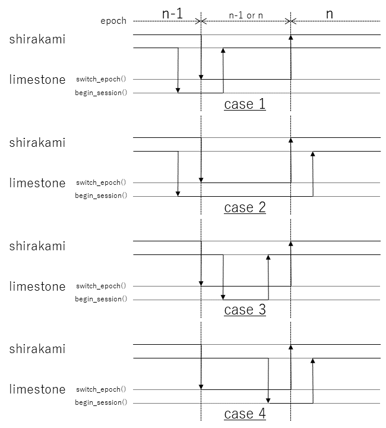
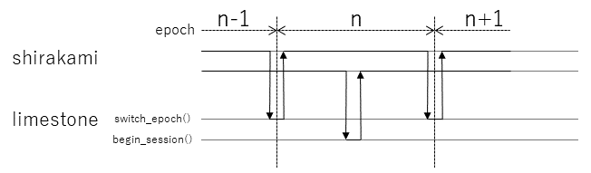
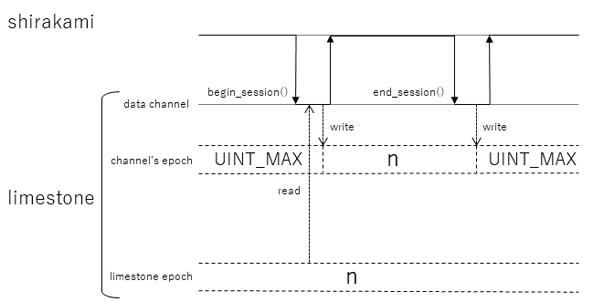
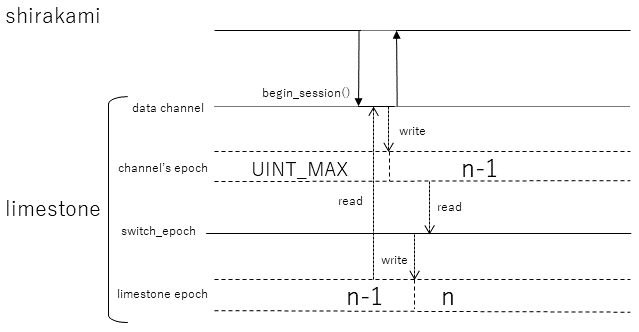
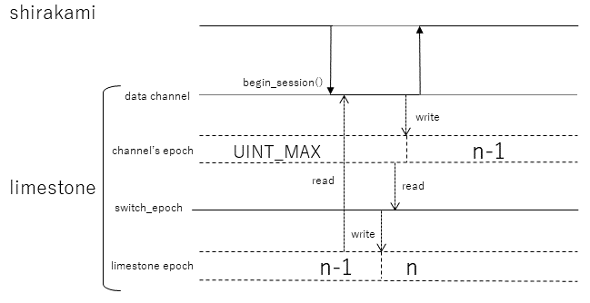
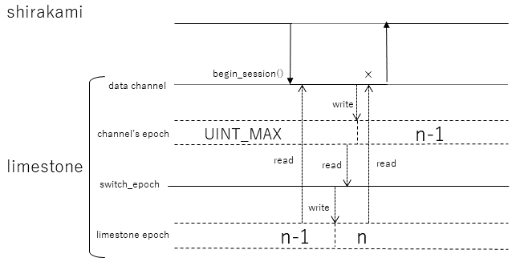

# limestoneにおけるraceについて

2023-10-23 horikawa

## この文書について
下記を説明する。
* shirakamiがcallすることを想定しているlimestoneのdatastore::switch_epoch()とdata_channel::begin_session()のタイミング制約
* durable epochを決める前提となるdata_channel::begin_session()の挙動、特に、begin_session()が属するepochを決める方法

## log書き込みの基本動作
1) あるepochに属するlogのshirakamiによる書き込みは、data_channel::begin_session()で開始し、data_channel::add_entry()によりlogをlimestoneに送り、data_channel::end_session()で終了する。
2) 通常、limestoneはdata_channel::end_session()を契機として、data_channel::add_entry()によって送られたlogを不揮発性記録媒体に書き込む操作を開始する。
3) logが属するepochは、data_channel::begin_session()をcallしたときのlimestone epochとなる。
4) limestone epochは、shirakamiがdatastore::switch_epoch()をcallすることで切り替わる。
5) どのlimestone epochまでdurableになった（logが不揮発記録として書き込まれた）のかは、datastore::last_epoch()で調べることができる。
6) durableとなったlimestone epochは、datastore::add_persistent_callback()でcallbackを登録しておくことで、durable epochがが更新される度にcall backとして通知を受け取ることもできる。
なお、現在の仕様では、data_channel::begin_session()により開始したlog書き込みが属するlimestone epochを陽に知ることはできない。

## shirakami
### limestoneに対する操作
* shirakamiは、datastore::switch_epoch()により、limestone epochの切り替わりをlimestoneに伝える。
* shirakamiは、data_channel::begin_session()により、現在のlimestone epochに属するlog書き込み開始をlimestoneに通知する。

上記の操作がshirakamiの別スレッドで実行されると、両者の間でlimestone epochに関するraceが発生する可能性がある。つまり、
shirakamiがlimestone epochをn-1からnに切り換えるためにdatastore::switch_epoch()をcallする場合、それがreturnするまでの間はlimestone epochがn-1かnかは不定となるため、
その実行期間（callからreturnまでの間）とdata_channel::begin_session()の実行期間に重なりがあると、data_channel::begin_session()が属するlimestone epochがn-1なのかnになるのかが不定となる。
（図1 case 1～4）。

図１　datastore::switch_epoch()とdata_channel::begin_session()の実行期間が重なっている場合

なお、両者が重なっていない場合（図２）は、data_channel::begin_session()が属するlimestone epochが不確定となることはない。

図２　datastore::switch_epoch()とdata_channel::begin_session()の実行期間に重なりがない場合

## limestone
### durable epochの定義
limestoneが認識するdurable epochは、
1) limestone epochより小さく、かつ、
2) 不揮発性記憶への書き込みが完了していないlogを持っているdata_channelのepoch
よりも小さいepochの最大値である。

### limestoneによるdurable epochの追跡
limestoneがdurable epochを認識できるようにするため、各log_channelは、各々が書き込んでるlogのepochを管理している。
その基本動作を図３に示す。

図３　log_channelによるlogのepoch管理 
各log_channelは、begin_session()時にlimestone epochを調べ、そのepochを以降のadd_entry()で送られるlogのepoch（channel's epoch）として記憶しておく。
ここで、channel's epochがUINT_MAXとなっている期間は、log_channel::begin_session()が行われていない（未書き込み尾logは存在しない）ことを示している。
なお、channel's epochはlimestone内の他モジュールから読み出せるようになっている。

### channel's epochに関する制約
limestoneによるdurable epochの認識でraceが発生しないようにするため、各々のlog_channelがlogのepochを確定する操作には、以下の制約を設ける。
* limestoneのモジュールがlimestone epochとしてnを読み込んだ後（datastore::switch_epoch()によりnが設定された後）に全log channelのlog epochを読み出す操作を行った場合、
n-1以下のlogを書き込んでいるlog_channelが存在するのであれば、そのchannel's epochは必ずreadできる。

端的な例を示すと、datastore::switch_epoch()がnをlimestone epochとして書き込んだ後に全log channelのlog epochを読み出すと、
n-1以下のlogを書き込んでいるlog_channelが存在するのであればそのchannel's epochは必ずreadできる（図４の状況）、
逆に、n-1以下のlogを書き込んでいるlog_channelが存在しないことが判明した場合は、
その操作それ以降にepochがn-1以下のlog書き込みを開始（begin_session()）するlog_channelは存在しないことが保証されている、ということである。

図４　datastore::switch_epoch()とlog_channel::begin_session()の関係 
switch_epoch()がlimestone epochをn-1からnに更新した後にlog_channelのchannel's epochをreadした場合、n-1のchannel's epochがreadできる状況。

但し、naiveに構築された（race対策が施されていない）log_channel::begin_session()では、図５に示すraceが発生し、上記の制約を満たさなくなる。

図５　datastore::switch_epoch()とlog_channel::begin_session()間のrace 
switch_epoch()がlimestone epochをn-1からnに更新する際、log_channel::begin_session()は更新前のlimestone epochをreadし、switch_epoch()によるchannel's epochのread操作後にchannel's epochをn-1に設定すると、channel's epochに関する制約を満たさなくなる。

このため、log_channel::begin_session()では、図６に示すように、channel's epochへの書き込みを行った後、再度limestone epochを読み込み、それがchannel's epochに書き込んだepochと同じかどうかを確認する。
両者が一致している場合は、channel's epochに関する制約が満たされるので、begin_session()の操作を完了させる一方、
両者が異なっている場合は、channel's epochへの書き込み操作を再実行し、channel's epochに書き込んだepochと同じ値がlimestone epochから読み込まれるまで繰り返すことで、
channel's epochに関する制約を満たすことを保証する。

図６　datastore::switch_epoch()とlog_channel::begin_session()間のrace防止 
log_channel::begin_session()が更新前のlimestone epoch（n-1）をreadしてchannel's epochに設定後、再度limestone epochをreadし、それがn-1でない（図ではnの）場合はchannel's epochの設定操作をやり直す。

このようなlimestone epochの再読み込みを行うと、「channel's epochに関する制約」が満たされることを図７に示す。

図７　datastore::switch_epoch()とlog_channel::begin_session()間のrace防止 
log_channel::begin_session()が更新前のlimestone epoch（n-1）をreadしてchannel's epochに設定後、再度limestone epochをreadした値がn-1の場合、
そのchannel's epochは、switch_epoch()がn-1をnに更新した時点でn-1であることが保証される。

なお、このようなリトライを行うと、channel's epochとして最初に書き込んだn-1がswitch_epoch()等からreadされる可能性もある。
この場合、n-1がdurable epochになっているにも関わらず、それはdurable epochではないと誤認識される可能性につながることになる。
但し、この誤認識は安全方向（危険方向の誤認識は「durableでないにも関わらずdurableと認識」される方向）であることと、発生頻度は非常に低い、の２点から実用面での問題はないと考えられる。