## この文書は何か

LOG-2実装の詳細についての各種メモ
* 設計文書では触れなかった、別構成の案も記載している。

(未整理)

## ログ反映部: 吸い上げ処理

ログエントリの情報を VB に投入する処理の部分について記載する。

吸い上げ型実装
* 吸い上げ型では `log_channel` は LOG-0 までと同じ処理しかしない。ログディレクトリに (channel ごとの) pWAL ファイルを作成し、末尾に追記していく。
* この機構に対して、追記されたログエントリを VB に吸い上げる機構を外付けすることにより、疎結合なアーキテクチャとする。
* 狙い: 
    1. `log_channel` がクライアントに処理を返すための必要最小限なことのみを実行する。これにより LOG-0 に近い書き込み処理性能を狙う。(LOG-1 以降の機能追加による性能劣化を抑える)
    2. LOG-1 以降の機能を実現する部分が LOG-0 までの機構に対して外付けされた形をしており、結合性を極端に低くしている。
* ログに追記されたことを検出するために、ログディレクトリを監視する。(監視型)
* 外付け方式として、別スレッドとして実行、または別プロセスとして実行、の選択の余地がある。
* 監視方法は
    * inotify/kqueue でディレクトリを監視し、変更が検出されたファイルを read する
        * ファイルを開きっぱなしにしておくか、いちいち開きなおすか、のいずれかのやり方がある
    * 監視対象候補すべてを open し、ファイルを無限 loop で read し続ける
* 吸い上げ型の変種として、外付けした監視機構から追記を検出するのでなく、`log_channel` がログデータを受け取り、pWAL ファイルに追記したのちに吸い上げ機構へ通知するという方法が考えられる。(通知型)

(コメント) 吸い上げは別プロセスで実現しうるのか
* LOG-1 レベルなら問題ない。(RocksDB だと) 吸い上げ機構が Writer として SSDS の DB ディレクトリを更新し、本体側 limestone は restore 処理等で読む際には ReadOnlyDB / SecondaryDB として DB ディレクトリを読めばよい。
* マイクロベンチマークの候補としても好適では?
* LOG-2 レベルだと、制御流が多くていろいろ厳しい
    * コントロール用のプロセス間チャンネルを別途用意すればできなくもないが、コストはかかる

push 型実装
* push 型実装では `log_channel` が (メモリで渡された) ログデータを pWAL への書き込んだ直後に、加えてそのログエントリを VB に追加する (データは pWALファイルを経由しない)
* 狙い: 吸い上げ型の pWAL ファイルに一度書いてから読む、という手法よりも ディスク I/O オーバーヘッドが少なくなることを狙っている。
* VB への追加を、直列で実行する方法と、別スレッドに渡して並行で実行する方法がある。
    * 別スレッド方式の処理手順
        * pWAL に書き終わったら、enQ スレッドを作成し、複製したログエントリを渡す
        * データ呼び出し元に処理を戻す
        * enQ スレッド は受け取ったログエントリを (必要に応じて形式変換して) VB へ追加する。
    * 直列方式の処理手順
        * pWAL に書き終わったら、受け取ったログエントリを (必要に応じて形式変換して) VB へ追加する。
        * データ呼び出し元に処理を戻す

## ログ反映部: Version Buffer (VB)

VB に対して行われる操作は、データの追加 (一エントリ), safe snapshot 進捗に伴うデータ読出し (範囲リード), 永続化 である

write version (wv) を優先度とする Priority Queue (PQ) で実現する (wv が低いものが高優先度)。
VB は最終的な格納場所でなく、あくまで一時的なバッファであるという位置づけなので、データをディスクに書き込ませずに済むなら、そうしたい。

* RocksDB を使って Priority Queue を実現する方法
    * RocksDB に PQ 用の Column Family (例えば "verbufCF") を作り利用する
    * 狙い: RocksDB を使うことにより機能の実装を省力化する
    * PQ へのデータの追加
        * 各ログエントリを RocksDB エントリ { key: `<wv, uniq_num_in_wv>`, value: `<epoch, payload>` } にマップする
            * ログエントリの wv は重複することが多いが、RocksDB ではキーがかぶるとエントリが上書きされてしまうから、 (wv と組み合わせて) uniq になるように、数値を一つ足す。
            * `uniq_num = <channel_id, record_num_in_file>` みたいに スレッド固有値とスレッド内seq (先頭から数えて何レコード目とか) の数値の組でよさそう
    * PQ からの値の読出し (範囲リード)
        * Iterator を作って、先頭の一エントリを取り出して、Iterator を閉じて、取り出したデータを Delete する (必要なだけ繰り返す)
        * 範囲リードだからと言って、Iterate しながら Delete すると、(よくある話だが) おかしくなる
            * Iterator の Reset() で解決できないかと思ったが、できなかった。あれ何に使うんだ
    * 永続化
        * RocksDB なので永続化されている。また DB::Flush で memtable をフラッシュしてファイルに書き出すことができる (RocksDB の WAL を省略した場合にはこの処理が必須となる)
    * RocksDB チューニング設定値
        * さっさと L1 まで落としたいので memtable サイズ は小さめで良い
        * 一番小さい値から読んで消していくので Leveled compaction 向き (Tiered では非効率)
* 自前で Priority Queue + ファイル書き出しで実現する方法
    * 狙い: 可能な限りメモリ中に持ち、ディスクを解することによるパフォーマンス低下を避ける
    * メモリ中に Priority Queue を用意する。
        * 並行アクセス可能な実装を提供するコンテナライブラリ等を探して用いる
    * 大量にデータがため込まれて、メモリ使用量が閾値を超えるような場合には、VB の中身をファイルに書き出して管理する
        * 書き出されるファイルは、作成完了後は変更を加えない (immutable とする)
        * ログエントリオブジェクトが占有するメモリの量を正確に知ることは難しいので概算値とする。
    * PQ へのデータ追加
        * PQ の要素挿入を行う (PQ の基本操作)。
        * メモリ使用量概算値を増加させ、閾値を超えていたならば
            * PQ を優先度順に全読出しして、スワップアウトファイルに吐き出す。ファイルにはユニークなファイル名を設定する
            * 吐き出し処理中にさらに別スレッドから挿入を実施しても構わない。
    * PQ からの値の読出し (範囲リード)
        * 永続化/スワップアウトファイルがない場合
            * PQ から最優先エントリの取り出しを、繰り返す
                * 空になったら終了
                * 取り出した要素の優先度が、範囲外であったらそのエントリを PQ へ戻して(再挿入して)、終了
        * 永続化/スワップアウトファイルがある場合は、
            * (優先度順に並んでいる)ファイルをすべて開き、先頭に seek する。
            * PQ については、PQ から最優先エントリの取り出しを、繰り返す
                * 空になったら終了
                * 取り出した要素の優先度が、範囲外であったらそのエントリを PQ へ戻して(再挿入して)、終了
            * ファイルについては ファイルの現在位置から、一レコード取り出す、を繰り返す
                * EOF になったら終了
                * 取り出した要素の優先度が、範囲外であったらそのエントリ以降の全要素を PQ へ戻し、終了
            * 上記2項の要領で PQ, ファイルから取り出し、優先順位の高いほうから消費していく。マージソートの要領。
            * (範囲読出しに伴い、すべてのファイルを消費しきる点に注意。範囲外データはPQに戻される)
    * 永続化
        * PQ を優先度順に全読出しして、ファイルに吐き出す
        * 吐き出し処理中にさらに別スレッドから挿入を実施しても構わない。
    * 制約
        * PQ が空であっても入らないほど大きなエントリが来ると対応できない。(一エントリでメモリ割り当て可能量を超える場合)
            * 他 Tsurugi モジュールの制約を鑑みて、データサイズに制限を課すことにする。

## ログ反映部: Version順反映処理

* safe snapshot version が更新されるたびに実施される処理。
* VB から safe snapshot version 以前の範囲のログエントリを順に取り出し、SSDS に逐次データ反映する。

### Safe Snapshot データストア (Safe Snapshot Datastore / SSDS)

* RocksDB を使用する
    * RocksDB に SSDS 用の Column Family を作り利用する (あるいは default CF を使用する)
    * RocksDB はこのような Write-Heavy なデータの格納に向いている
* あるいは 永続化可能で堅牢な KVS を手で実装

(以下では、SSDS は RocksDB を使用するものと仮定して記述する)

### PITR

* PITR 作成処理:
    * PITR 領域識別子を発行する
    * ローテート処理を実行する
    * PITR 保存領域に DB領域(SSDS と VB) のコピーを作る。
        * PITR 保存領域内部に PITR 領域識別子に対応した名前のディレクトリを予約する (これを予約ディレクトリと呼ぶ)
        * RocksDB の Checkpoint を 予約ディレクトリ内に作成する。
            * 一貫性のとれた RocksDB イメージが作成される。容量の大半は immutable な SSTables ファイルであり、RocksDB はこれらのコピーはハードリンクで済ませるため、低負荷で実行可能である。
        * VB をインメモリ実装した場合には、ファイルに書き出して保存する。
            * VB を永続化する。永続化されている全ファイルを ハードリンクで 予約ディレクトリ内 にコピーする。
* PITR 復元処理:
    * (PITR 領域識別子で特定されるデータを メイン DB 領域へ復元する処理)
    * PITR 領域識別子に対応するディレクトリが指す PITR 保存領域ディレクトリから、メイン DB 領域へ全ファイルを移動する。
        * (これにより領域識別子で指定された PITR データは消滅する)
    * 今回復元した PITR より epoch の大きい PITR データを PITR保存領域からすべて消去する。
    * pWAL ファイルをすべて除去する (削除する必要はないが、二度と使わないので邪魔にならない場所に移動する)
    * (メモ) PITR復元はデータベース接続開始前であり、データベース正常シャットダウン後の再起動であれば WAL は VB へ読み込み消費しつくされているはずなので、未吸い上げWALは何もないはず。
* PITR 領域一覧管理:
    * PITR保存領域中に存在するディレクトリ名一覧が、PITR 領域識別子に一対一で対応しているので、これをスキャンすれば得られる
    * あるいは RocksDB 中に PITR 管理 CF を作成する。 (ランダムアクセスができる程度の利便性は得られる)

### フルバックアップ

* フルバックアップ処理:
    * ローテート処理を実行する
    * (PITRと同様に) メインDB一時保存領域に DB領域(SSDS と VB) の一時コピーを作る。
    * バックアップ領域のファイル群を全列挙する。
    * ファイル名が同じファイルはハードリンクになっているので、スキャン中に見つけた二個目以降のファイルは、ハードリンク位置情報とする。
    * データベースサーバプロセスは、バックアップ対象情報 { ファイル一覧, ハードリンク位置一覧 } を外部バックアッププロセスに送付する。
    * 外部バックアッププロセスは、バックアップ対象情報をもとに、ファイルを外部に保存する。
    * バックアップ処理完了後に(処理開始時に作成した)一時コピーを削除する。
* フルバックアップ復元処理
    * 外部バックアッププロセスから、バックアップ領域 (DB領域(SSDS と VB) 、PITR 保存領域) が、ハードリンク状態も含めて復元される。(上記処理の逆)
    * pWAL ファイルをすべて除去する (削除する必要はないが、二度と使わないので邪魔にならない場所に移動する)
    * メインDB一時保存領域のデータを DB領域(SSDS と VB) に取り出し、復元する。

## 初期制約

ログエントリのサイズは最大 1MB 程度の制約を置いた。
* 現在トランザクションエンジン側で 1KB 程度しか扱えていないので、このサイズのデータが来ることはあり得ない。
(チャンクするなど) 実装の工夫で制約は取り外せるが、後回しとしたい。

